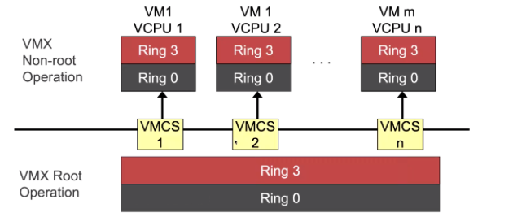

# 系统虚拟化 1

**id: 519021910861** 
**name: xuhuidong**

> 1. 假设在 Virtualizable 硬件上使用 Trap-and-Emulate 方法实现 CPU 虚拟化。1）请描述 VM 内的用户态线程执行 System Call 被 VM 内核处理并返回的全过程。2）进程内执行 Fork Bomb 是否会大量增加 VMM 的线程并大量消耗 VMM 的资源。

1) 首先系统会捕获当前调用系统 ISA 并产生 Trap 进入到 VMM，然后在 VMM 里会有具体的指令用软件模拟的方式实现系统 ISA 虚拟化的效果，效果包括控制虚拟 CPU（开关中断）、内存（改 TTBR）、设备（访问硬件设备寄存器、让硬件格式化等）的行为，最后就回到虚拟机里继续执行。
2) 不会。因为在虚拟机启动时，会对虚拟机监控器声明需要 n 个 v-CPU，虚拟机监控器也就对应创建 n 个 v-CPU 并把时间片交给虚拟机。这之后，虚拟机会自己维护调度队列去运行线程，Fork Bomb 确实会大量增加虚拟机的线程，但是分给虚拟机的 v-CPU 和时间片都是固定的，所以需要虚拟机自己去调度这些线程运行。从 VMM 的角度上来看，始终都只有最多 n 个 v-CPU 线程的时间片被消耗了，所以 Fork Bomb 并不会大量消耗 VMM 的资源。

> 假设有一台支持 Intel VT-x 和 8 个物理 CPU 的服务器，在其上运行 1 个 VMM 和 10 个 VM，每个虚拟机又 4 个 vCPU。若该 VMM 使用了 VT-x 硬件虚拟化，需要创建多少线程为这些 VM 服务（只考虑 CPU 虚拟化）？总共需要创建多少个 VMCS？请解释原因。

需要创建 40 个线程为这些 VM 服务，总共需要创建 40 个 VMCS。因为每个 VMCS 都只保存一个 v-CPU 的状态，所以每个 v-CPU 都需要对应一个 VMCS。如图所示，共有 $m$ 个虚拟机和 $n$ 个 v-CPU，则会有 $n$ 个 VMCS。我们的 Hypervisor 在保存和恢复时都要通过控制 VMCS。

> ARM v8.0 的硬件虚拟化机制为 Type-1 VMM 所设计，当直接在 EL2 内运行 Type-2 VMM（如 KVM）时会存在一些问题。请具体解释会造成哪些问题？为此，KVM/ARM 提出了什么样的解决方案？该方案是否存在 VM Exit 处理路径上的性能问题？

在硬件虚拟化还未提出时，只有 EL0 和 EL1 两个特权级。有了硬件虚拟化之后，多出 EL2 专用于运行虚拟机监控器，此时系统的最高特权级是 EL2。在 x86 中，任何一刻都只能有 1 个 CR3，但是在 ARM 中不一样。例如 `ttrb0_el1` 就是专门给 `el1` 使用，因此所有寄存器后面都带上 `_el2` 的后缀，导致 Hypervisor 对 ARM 做硬件虚拟化支持的时候遇到了很多障碍。还有就是，有了 el2 之后页表格式也发生了变化，和之前 el1 的不一样。

因为有上述问题存在，当我们要把 Linux 变成 Type-2 的 Hypervisor时，就无法简单地把 Linux 放在 EL2 运行。为此，KVM/ARM 把 Linux 里硬件虚拟化分成了 VMM Highvisor（跑在 EL1 上）和 VMM Lowvisor（跑在 EL2 上）两个部分。Linux 中其他功能仍旧运行在 EL1 上，这样就可以复用之前的代码。

对于 Type-2 的 Hypervisor，我们必须要做 split 操作。在虚拟机进入到我们的 Lowvisor 时，将保存和恢复寄存器（EL1）状态到内存中，然后继续交给 Highvisor 处理。处理完毕后，我们来到 EL2 中，又需要把 Highvisor 的寄存器存到内存里，然后恢复虚拟机 EL1 的寄存器和状态。这个设计原意是为了提高性能，但是 Type-2 无法得到这个好处，所以整个 VM Exit 上确实存在性能问题。

> 假设使用影子页表机制实现内存虚拟化。现有 10 个虚拟机，每个虚拟机内有 10 个进程，VMM 总共需要创建多少个影子页表？

影子页表机制中，每个进程的页表是相互独立的，每一个虚拟机的每一个进程都需要一个影子页表，且每台虚拟机还需要一个内核态影子页表，所以一共需要创建 $10 \times (10 + 1) = 110$ 个影子页表。