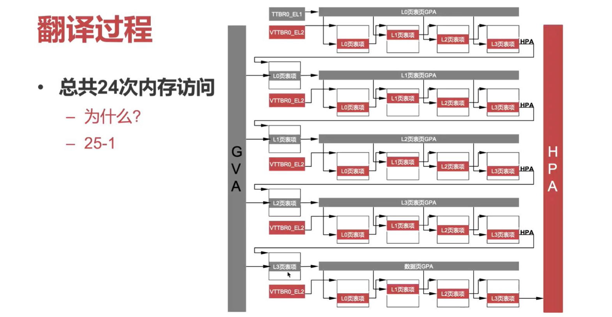

# 系统虚拟化 2

**id: 519021910861** 
**name: xuhuidong**

> 1. 在 x86 和 ARM 平台引入硬件虚拟化技术之后，指令模拟和半虚拟化的技术是否还有存在的意义？

有。因为修改硬件是个极其麻烦的事情，除了需要向硬件制造厂商证明对现有硬件做修改是利大于弊的，而且还需要对硬件有足够的研究投入才可以做到。

虽然敏感指令不下陷等问题最终都是需要依靠修改硬件来实现，但是系统软件开发人员不能坐以待毙，因此在硬件做出相应修改前便创造了指令模拟和半虚拟化技术等方法。

x86 和 ARM 平台对硬件虚拟化的引入意味着硬件虚拟化已经逐渐被人们接收，但是这不意味着其他平台能在短期内将硬件虚拟化引入他们的架构，甚至有些 CPU 架构可能本身存在缺陷无法完全兼容这种硬件虚拟化技术，因此我们还是需要同步发展指令模拟和半虚拟化技术。

而且，指令模拟和半虚拟化技术也都有各自不可替代的优点，比如指令模拟解决了敏感函数不下陷的问题且易于实现，而半虚拟化技术则速度更快性能更好。

> 2. 假设有 10 个虚拟机，每个虚拟机有 10 个 vCPU。总共几个 QEMU 进程？每个进程中有多少个线程（假设 KVM/QEMU 系统，忽略 QEMU 的 iothread）？

10 个 QEMU 进程，一个 QEMU 进程对应一个虚拟机，而 QEMU 会给每个 vCPU 开启一个 vCPU thread，所以每个 QEMU 进程中都有 10 个线程（忽略 iothread）。

> 3. 在不考虑 TLB 的情况下，若使用硬件虚拟化里的第二阶段地址翻译机制实现内存虚拟化，将 GVA 翻译到 HPA 需要经过多少次内存访问？为什么？

如 PPT 中所示，需要 24 次内存访问。首先我们要访问 GVA，则必须先翻译成 GPA，所以 MMU 从 ttbr0_el1 得到第一阶段 L0 页表的 GPA，但 GPA 不能直接访存，需要先翻译成 HPA，所以我们根据第一阶段 L0 页表的 GPA 一次经过第二阶段页表的 4 次方寸，最终获取到 ttbr0_el1 存储的 HPA，然后我们继续根据 L0 页表获得第一阶段 L1 页表的 GPA 基地址，以此类推，从图中可以看出需要有 20 次第二阶段页表的逐级访存，而每次拿到第一阶段 PTE 和 HPA 后需要访存才能获得第一阶段的下一级页表共要 4 次，所以整个翻译总共是 $20 + 4 = 24$ 次内存访问。

> 4. （1）在半虚拟化 I/O 中，Virtio Virtqueue 技术相对于模拟 I/O 方法的优势体现在哪里？

1. Virtio 实现了尽可能多的设计共享，因此在开发的时候可以复用很多软硬件资源，开发效率较高，不再需要理解物理设备接口。
2. Virtio 有更高的 I/O 性能，因为实现粒度粗，可以将模拟 IO 方法中的多个 MMIO/PIO 指令的多次数据路径整合成一个 Hypercall。

> 4. （2）使用 SRIOV 设备直通方法具有最佳的 I/O 性能，请问为什么目前云中依然大量使用了半虚拟化 I/O 技术？

1. 由于设备直通需要 IOMMU 和 SRIOV 的支持，且不能完全实现 interpostion 和虚拟化的热迁移，而在云端中虚拟机热迁移又是很重要的。
2. 半虚拟化技术逐渐成熟，已经可以最大程度上避免 trap 的 overhead，所以性能上不会相差太大。

> 4. （3）IOMMU 被广泛用于连接 I/O 设备和主内存，解释为什么 IOMMU 对于设备直通的 I/O 虚拟化技术至关重要吗？如果将物理设备直接分配给一个虚拟机，该设备的 IOMMU 应该翻译什么地址（从什么地址到什么地址）？
	
IOMMU 是为了解决 DMA 恶意读写内存而在 DMA 的数据通路上外加的一个页表，其作用就是尝试将虚拟机内部地址翻译成 HPA，如果允许的话我们就可以翻译成对应的访问内存，如果不允许我们就报错。如果没有 IOMMU 的话，DMA 可以完全绕过 CPU 内存检查访问到另外一个 VM 的内存，甚至可以读写，造成很严重的后果。

如果将物理设备直接分配给一个虚拟机，该设备的 IOMMU 应该将虚拟机物理地址空间中的 GPA 翻译成 HPA。

