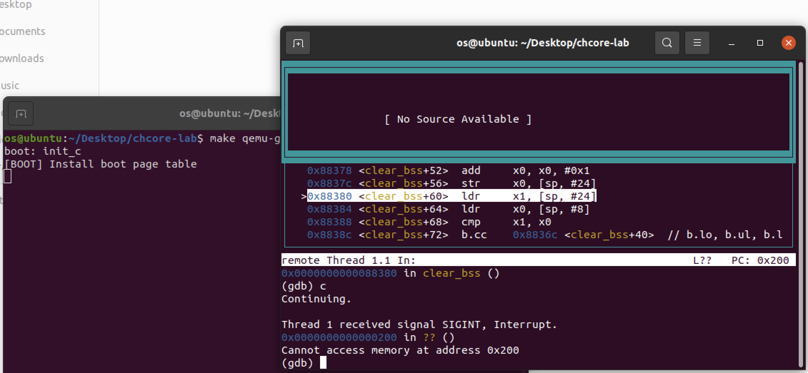
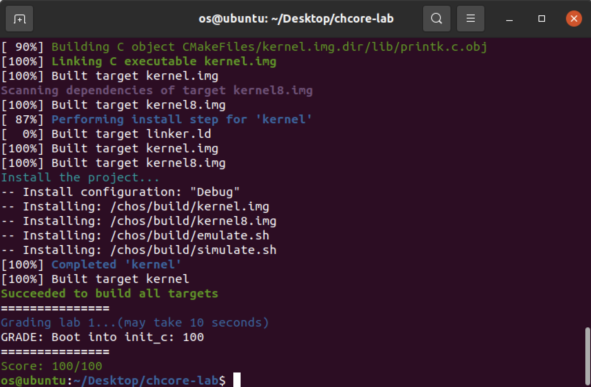

# OS-lab1: 机器启动

**id: 519021910861** 
**name: xuhuidong**

## 目录

- [目录](#目录)
- [问答题](#问答题)
- [参考](#参考)

## 问答题

> 思考题 1：阅读 _start 函数的开头，尝试说明 ChCore 是如何让其中⼀个核⾸先进⼊初始化流程，并让其他核暂停执⾏的。

Chcore 在 `_start` 函数开头有如下代码，

```
1. mrs x8, mpidr_el1
2. and x8, x8, #0xFF
3. cbz x8, primary
4. b	.
```

在 `1` 代码中将 `mpidr_el1` 寄存器的值移入 `x8` 寄存器中，在 `2` 代码中将 `x8` 寄存器中的低 8 位取出，而 `3` 代码中则对低 8 位 进行是否为 0 的检测，如果是 0 才进入 `primary` 函数中进行初始化，否则执行 `4` 代码不断跳转到当前地址，即被挂起。

而 `mpidr_el1` 低 8 位对应的是 Affinity level 0，仅有一个核的这个字段为 0，所以检测后可以让其中一个核进入 `primary` 部分进行初始化，而其他核则循环执行 `4` 而被挂起。

> 练习题 2：在 arm64_elX_to_el1 函数的 LAB 1 TODO 1 处填写⼀⾏汇编代码，获取 CPU 当前异常级别。

填写代码为

```
mrs x9, CurrentEL
```

即通过 `CurrentEL` 获取当前异常级别并移至 `x9` 寄存器中，方便后续比较。

> 练习题 3：在 arm64_elX_to_el1 函数的 LAB 1 TODO 2 处填写⼤约 4 ⾏汇编代码，设置从 EL3 跳转到EL1 所需的 elr_el3 和 spsr_el3 寄存器值。具体地，我们需要在跳转到 EL1 时暂时屏蔽所有中断、并使⽤内核栈（ sp_el1 寄存器指定的栈指针）。

填写代码为

```
adr x9, .Ltarget
msr elr_el3, x9
mov x9, SPSR_ELX_DAIF | SPSR_ELX_EL1H
msr spsr_el3, x9
```

`elr_el3` 寄存器用于控制异常返回后执行的指令地址，在这里需要设置为 `.Ltarget`。而`spsr_el3` 寄存器用于控制返回后应恢复的程序状态，其中 `SPSR_ELX_DAIF` 用来设置屏蔽中断，而 `SPSR_ELX_EL1H` 用来设置内核栈。

> 思考题 4：结合此前 ICS 课的知识，并参考 kernel.img 的反汇编（通过 aarch64-linux-gnu-objdump -S 可获得），说明为什么要在进⼊ C 函数之前设置启动栈。如果不设置，会发⽣什么？

1. 保护现场/上下文，如将寄存器压栈等。如果不设置栈，则可能会导致上下文信息缺失。
2. 传递参数，如果参数较少可以只用寄存器传参，而参数过多时（如超过 4 个）则需要用到栈来传参。如果不设置，则可能调用参数很多的 C 函数时无法将所有参数有效传递。
3. 保存临时变量，包括函数的非静态局部变量以及编译器自动生成的其他临时变量。如果不设置，则可能导致临时变量在内层函数中被调用甚至修改。

> 思考题 5：在实验 1 中，其实不调⽤ clear_bss 也不影响内核的执⾏，请思考不清理 .bss 段在之后的何种情况下会导致内核⽆法⼯作。

全局变量与静态变量没有初始化或者初始化值为 0 时，就会被放在 `.bss` 段。而由于存储在 `.bss` 段内的数据在下一次启动代码时不会被自动的重新初始化为 0，这就可能导致上一次运行代码过程中有可能修改了全局变量或静态变量的值，而修改过的值会被 `.bss` 段保存下来，那么在下一次启动代码时我们定义的全局变量的值可能就不是我们第一次定义的 `0` 值了，因此可能引发如地址越界等 `bug` 而导致内核无法正常工作。

> 练习题 6：在 kernel/arch/aarch64/boot/raspi3/peripherals/uart.c 中 LAB 1 TODO 3 处实现通过 UART 输出字符串的逻辑。

填写代码为：

```
early_uart_init();
for (int i = 0; str[i] != '\0'; i++)
	early_uart_send((char) str[i]);
```

即先初始化然后不断 `for` 循环输出字符串中的字符。

> 练习题 7：在 kernel/arch/aarch64/boot/raspi3/init/tools.S 中 LAB 1 TODO 4 处填写⼀⾏汇编代码，以启⽤ MMU。

填写代码为：

```
orr x8, x8, #SCTLR_EL1_M
```

即设置最低位（M 字段）来启动 `MMU`。可以看出其在 `0x200` 处无限循环。



最终得分为：



## 参考

https://www.zhihu.com/column/c_1215698269139152896

https://www.cnblogs.com/kangyupl/p/chcore_lab1.html

https://blog.csdn.net/dcx1205/article/details/47184489