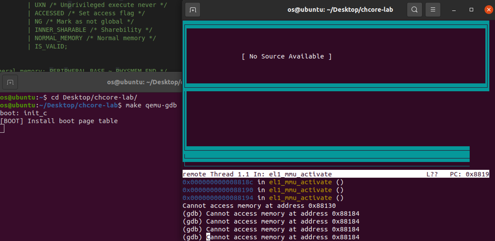
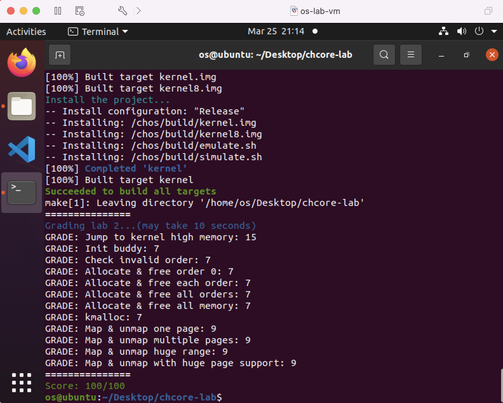

# OS-lab2: 内存管理

**id: 519021910861** 
**name: xuhuidong**

## 目录

- [目录](#目录)
- [问答题](#问答题)

## 问答题

> 思考题 1：请思考多级⻚表相⽐单级⻚表带来的优势和劣势（如果有的话），并计算在 AArch64⻚表中分别以 4KB 粒度和 2MB 粒度映射 0～4GB 地址范围所需的物理内存⼤⼩（或⻚表⻚数量）。

多级页表允许在整个页表结构中出现空洞，极大减少了页表占用的空间大小，但也导致设计较为复杂、内存利用效率降低（有内部碎片）等缺点。

以 $4 \text{KB}$ 粒度映射时，低 12 位表示页内偏移量，每一级页表的索引占用 9 位，所以一个页表项包含 $2^9$ 个页表项。

总共需要 $4 \text{GB} / 4 \text{KB} = 2^{20}$ 个页条目，因此需要 $2^{20} / 2^9 = 2^{11}$ 个 L3 页表，需要 $2^{11} / 2^9 = 2^2$ 个 L2 页表，需要 1 个 L1页表和 1 个 L0页表，因此共需要 $2^{11} + 2^2 + 1 + 1 = 2054$ 个页表页，每一个页表页占用 $4 \text{KB}$，所以需要占用 $2054  \times 4 \text{KB} = 8 \text{MB}$ 物理内存大小。

以 $2 \text{MB}$ 粒度映射时，2 MB 粒度映射时，低 21 位表示页内偏移量，最多有两级页表（不然 64 位存不下）。每一级页表的索引占用 18 位，所以一个页表项包含 $2^{18}$ 个页表项。

- 如果仅有一级页表，则总共需要 $4 \text{GB} / 2\text{MB} = 2^{11}$ 个页条目，因此仅需要 1 个 L1 页表，每一个页表页占用 $2 \text{MB}$，所以需要占用 $1 \times 2 \text{MB} = 2 \text{MB}$ 物理内存大小。
- 如果有两级页表，则总共需要 $4 \text{GB} / 2\text{MB} = 2^{11}$ 个页条目，因此仅需要 1 个 L2 页表，1 个 L1 页表，总共需要 $1 + 1 = 2$ 个页表页，每一个页表页占用 $2 \text{MB}$，所以需要占用 $2 \times 2 \text{MB} = 4 \text{MB}$ 物理内存大小。

> 思考题 3：请思考在 `init_boot_pt` 函数中为什么还要为低地址配置⻚表，并尝试验证⾃⼰的解释。

Chcore 在最初时运行在低地址，如果没有配置低地址页表则可能导致启用 MMU 后原有函数的返回地址（即低地址）无法正确映射，因此在 `init_boot_pt` 中还需要为低地址配置页表。

我们将为低地址配置页表的代码片段注释，利用 `gdb` 运行程序观察得到，MMU 无法翻译低地址。

> 思考题 7：阅读 Arm Architecture Reference Manual，思考要在操作系统中⽀持写时拷⻉（Copy-on-Write，CoW）需要配置⻚表描述符的哪个/哪些字段，并在发⽣缺⻚异常（实际上是 permission fault）时如何处理。

主要需要配置 **页表是否可写的权限位** 字段。即写时拷贝允许应用程序 A 和 B 以 **只读** 的方式共享同一段物理内存，一旦某个应用程序对该内存区域进行修改就会触发缺页异常。之后  CPU 会将控制流传递给操作系统预先设置的缺页异常处理函数，在该函数中，操作系统发现当前的缺页异常是由于应用程序写了只读内存，而且相应的内存区域又是被操作系统标记成写时拷贝的。于是，操作系统会在物理内存中将缺页异常对应的物理页重新拷贝一份，并且将新拷贝的物理页以 **可读可写** 的方式重新映射给触发异常的应用程序，此后再恢复应用程序的执行。

> 思考题 8：为了简单起见，在 Chcore 实验中没有为内核页表使用细粒度的映射，而是直接沿用了启动时的粗粒度页表，请思考这样做有什么问题。

因为内核可能会分配一些大小较小但有不同权限的内存片段，粗粒度页表不容易对权限做细粒度管理。且粗粒度页表可能会造成物理内存资源浪费，产生较多的碎片。

> coding 实验结果。

