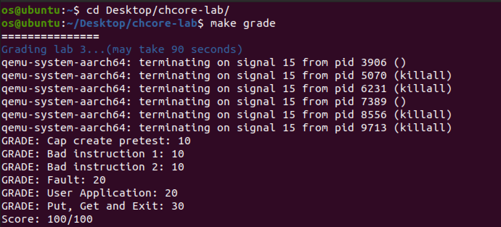

# OS-lab3: 进程与线程创建、异常处理

**id: 519021910861** 
**name: xuhuidong**

> 练习 1：内核从完成必要的初始化到用户态程序的过程是怎么样的？尝试描述一下调用关系。

以下为从操作系统初始化到调用第一行用户代码为止的代码调用：

```C++
1. start
2. main (kernel/main.c)
	(a) uart_init
  (b) mm_init
  (c) exception_init
  (d) process_create_root
  	i. process_create
  	ii.thread_create_main
  (e) eret_to_thread
  	i. switch_context
```

Chcore 启动后会依次初始化 `uart` 模块、内存管理模块、中断模块，然后调用 `process_create_root` 创建一个根进程，当前 lab 中也只有这一个进程。

`process_create_root` 会先从磁盘中载入 ELF 文件，然后创建进程的 `process` 结构体并初始化，包括 `slot_table` 的初始化和分配一块虚拟地址空间 `vmspace`，最后为进程创建一个主线程。

`eret_to_thread` 则使用 `eret` 指令完成从内核模式到用户模式的切换，并在用户模式下开始运行用户代码。


> 练习 2 - 练习 8：代码详情见 GitLab。

