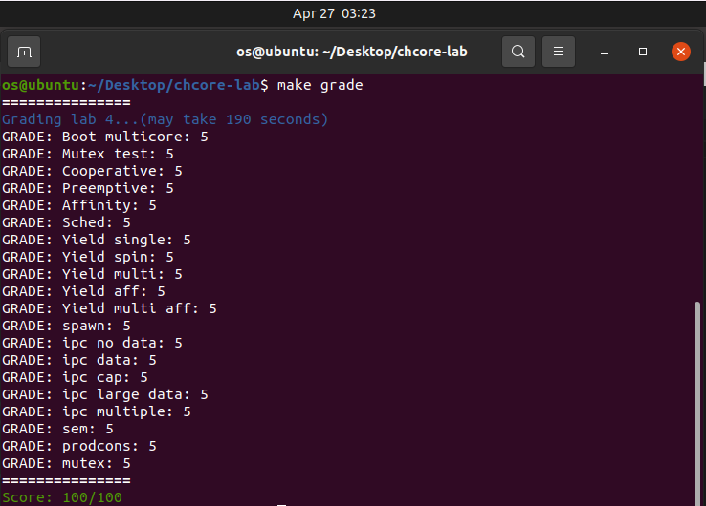

# OS-lab4: 多核、多进程、调度与IPC

**id: 519021910861** 
**name: xuhuidong**

## 目录

- [目录](#目录)
- [第一部分：多核支持](#第一部分：多核支持)
- [第二部分：调度](#第二部分：调度)
- [第三部分：进程管理器](#第三部分：进程管理器)
- [第四部分：进程间通讯](#第四部分：进程间通讯)
- [第五部分：内核信号量](#第五部分：内核信号量)

## 第一部分：多核支持

> 1. 阅读汇编代码 `kernel/arch/aarch64/boot/raspi3/init/start.S`。说明 Chcore 是如何选定主 CPU，并阻塞其他 CPU 的执行的。

Chcore 进入 `_start` 函数后 `mrs x8, mpidr_el1` 将当前 cpuid 放在了 `x8` 寄存器中，**并在 `cbz x8, primary` 中通过判断当前 cpuid 是否为 0 来选择主 CPU，即 cpuid 为 0 的 CPU 是主 CPU 并执行 `primary` 处的代码。**

**Chcore 通过控制 `secondary_boot_flag` 数组中其他 CPU 对应元素始终为 0 而让其他 CPU 不断循环等待来阻塞其他 CPU 执行。**具体而言，其他 CPU 在设置好栈后循环等待直至 `secondary_boot_flag[cpuid] != 0` 时才跳转到 `secondary_init_c` 进行初始化。主 CPU 在完成自己的初始化后调用 `enable_smp_cores`，在此设置 `secondary_boot_flag[cpuid] = 1`，让副 CPU 可以继续执行完成初始化。而每个副 CPU 初始化完成后会设置 `cpu_status[cpuid] = cpu_run`，因此只有只有在上个设置好后才可以设置下个副 CPU 的 `secondary_boot_flag[cpuid]`，保证了副 CPU 有序逐个的初始化。

> 2. 阅读汇编代码 `kernel/arch/aarch64/boot/raspi3/init/start.S`，`init_c.c` 以及 `kernel/arch/aarch64/main.c`，解释用于阻塞其他 CPU 核心的 `secondary_boot_flag` 是物理地址还是虚拟地址？是如何传入函数 `enable_smp_cores` 中，又该如何赋值的（考虑虚拟地址/物理地址）？

**`secondary_boot_flag` 是虚拟地址，是通过 `kernel/arch/aarch64/main.c`中 `main` 函数传参传入了物理地址 `boot_flag`，并在 `enable_smp_cores` 函数中通过 `secondary_boot_flag = (long *)phys_to_virt(boot_flag)` 转换成虚拟地址。**

**我们可以将其重新转换成物理地址并赋值，然后再转换回虚拟地址即可**。

> 3. 完善主 CPU 激活各个其他CPU的函数：`enable_smp_cores` 和 `kernel/arch/aarch64/main.c` 中的 `secondary_start`。请注意测试代码会要求各个其他 CPU 按序被依次激活。

首先设置 flag 为 1，并且让其不停循环等待。

```C++
for (i = 0; i < PLAT_CPU_NUM; i++) {
  secondary_boot_flag[i] = 1;
	while (cpu_status[i] == cpu_hang);
	...
};
```

> 4. 熟悉排号锁的基本算法，并在 `kernel/arch/aarch64/sync/ticket.c` 中完成 `unlock` 和 `is_lock` 的代码。在 `kernel/arch/aarch64/sync/ticket.c` 中实现 `kernel_lock_init`、`lock_kernel` 和 `unlock_kernel`。在适当的位置调用 `lock_kernel`。判断什么时候需要放锁，添加 `unlock_kernel`。

根据排号锁的原理，我们在 `unlock` 时将 `owner` 加加，而在判断是否上锁时比较 `owner` 和 `next` 字段的大小即可。

对于内核的上锁等一系列操作，都是对排号锁的一个包装，不再赘述。

我们在创建根进程前、其他进程开始调度前以及处理终端等位置需要上大内核锁，而解锁则只需要在处理完异常返回时即可。

```C++
/* kernel/arch/aarch64/main.c */
int main(paddr_t boot_flag) {
	...
#ifdef CHCORE_KERNEL_TEST
	run_test();
#endif
	lock_kernel();
	create_root_thread();
	...
};
/* kernel/arch/aarch64/main.c */
void secondary_start(void) {
	...
#ifdef CHCORE_KERNEL_TEST
	run_test();
#endif
	lock_kernel();
	sched();
	...
};

```

```C++
/* kernel/arch/aarch64/irq/irq_entry.c */
void handle_entry_c(int type, u64 esr, u64 address) {
    if (type >= SYNC_EL0_64)
        lock_kernel();
    ...
};
/* kernel/arch/aarch64/irq/irq_entry.c */
void handle_irq(int type) {
	if (type >= SYNC_EL0_64 || current_thread->thread_ctx->type == TYPE_IDLE) {
    	lock_kernel();
    }
}
```

```C++
/* kernel/arch/aarch64/irq */
sync_el0_64:
	...
	bl unlock_kernel
	exception_exit
/* kernel/arch/aarch64/irq */
el0_syscall:
	...
	bl lock_kernel
	...
	bl unlock_kernel
	exception_exit
/* kernel/arch/aarch64/irq */
BEGIN_FUNC(__eret_to_thread)
	mov	sp, x0
	dmb ish
	bl unlock_kernel
	exception_exit
END_FUNC(__eret_to_thread)
```

> 5. 在 `el0_syscall` 调用 `lock_kernel` 时，在栈上保存了寄存器的值，这是为了避免调用 `lock_kernel` 时修改这些寄存器，在 `unlock_kernel` 时，是否需要将寄存器的值保存到栈上，试分析其原因。


不用。因为从排号锁的实现中可以看出，`unlock_kernel` 只需要更改全局变量大内核锁 `big_kernel_lock` 的 `owner` 字段，而这个字段应该是在内存中，因此 `unlock_kernel` 不会改变寄存器中的值，所以也就不需要保护到栈上了。

## 第二部分：调度

> 6. 为何 `idle_threads` 不会加入到等待队列中？试分析其原因。

`idle_threads` 是每个 CPU 上的空闲线程，仅仅用在没有线程等待时上去顶替，这样做可以防止 CPU 发现没有能调度的线程卡在内核态，而由于我们现在使用的是分配时间片的轮询策略，因此所有在等待队列中的进程都拥有相同的优先级，如果让 `idle_threads` 进入队列的话，可能会“空转”浪费很多时间，故正常情况下 `idle_threads` 是不需要加入到等待队列中的。

> 7. 完善 `kernel/sched/policy_rr.c` 中的调度功能。

在 `rr_sched_enqueue` 中，我们首先需要判断 `thread` 是否为空、状态是否是 `TS_READY` 等条件，然后对其亲和性进行判断并赋予相应的 `cpuid`，记住将 `state` 设置为 `TS_READY` 再加入等待队列中。

在 `rr_sched_dequeue` 中，我们首先对 `thread` 的参数进行检查，然后使用 `list_del` 函数将其移出等待队列，记住将 `state` 设置为 `TS_INTER`。

在 `rr_sched_choose_thread` 中，我们选择等待队列的对首并尝试让其出队，如果出队失败（即队列为空），则返回对应 `cpu` 的空闲进程，否则返回这个出队 `thread`。

在 `rr_sched` 中，我们首先对 `thread` 参数进行检查，并将当前进程线程挂起，然后从等待队列中选取下一个线程，并将时间片填满（即填上 `DEFAULT_BUDGET`）再调度。

具体代码详见 GitLab。

> 8. 如果异常是从内核态捕获的，CPU 核心不会在 `kernel/arch/aarch64/irq/irq_entry.c` 的 `handle_irq` 中获得大内核锁。但是，有一种特殊情况，即如果空闲线程（以内核态运行）中捕获了错误，则 CPU 核心还应该获取大内核锁。否则，内核可能会被永远阻塞，请思考一下原因。

我觉得原因可能有两个：1. 因为空闲线程的作用就是为了防止 CPU 发现没有能调度的线程而卡在内核态，所以当空闲线程出现了错误时应该获取大内核锁并由内核去解决错误，如果忽视这个错误很有可能导致空闲线程挂掉，之后 CPU 再次调度时如果发现没有能调度的线程时就会永远阻塞。2. 当一个内核态线程返回到用户态时会释放大内核锁，然而 `idle` 线程并没有拿到过大内核锁，所以如果它捕获了错误，就可能会在没有大内核锁的情况下释放大内核锁，导致整个排号锁以及调度都出错。

> 练习 9：在 `kernel/sched/sched.c` 中实现系统调用 `sys_yield()`，使用户态程序可以启动线程调度。此外，Chcore 还添加了一个新的系统调用 `sys_get_cpu_id`，其将返回当前线程运行的 CPU 的核心 id。请在 `kernel/syscall/syscall.c` 文件中实现该函数。

在 `sys_yield` 中我们将当前线程的 `budget` 直接设置为 0，以便之后立刻切换线程。

```C++
/* kernel/sched/sched.c */
void sched_handle_timer_irq(void) {
    if (current_thread && current_thread->thread_ctx && current_thread->thread_ctx->sc && current_thread->thread_ctx->sc->budget && current_thread->thread_ctx->sc->budget > 0) {
        --current_thread->thread_ctx->sc->budget;
}
```

而系统调用 `sys_get_cpu_id` 则直接通过调用 `smp_get_cpu_id` 函数即可。

```C++
u32 sys_get_cpu_id() {
  u32 cpuid = 0;
  /* LAB 4 TODO BEGIN */
  cpuid = smp_get_cpu_id();
  /* LAB 4 TODO END */
	return cpuid;
}
```

> 10. 定时器中断初始化的相关代码已包含在本实验的初始代码中 `timer_init`。请在主CPU以及其他CPU的初始化流程中加⼊对该函数的调⽤。

在 `main.c` 中对应留出的 `LAB 4 TODO` 的两个位置填上 `timer_init` 即可。

> 11. 在 `kernel/sched/sched.c` 处理时钟中断的函数 `sched_handle_timer_irq` 中添加相应的代码，以便它可以⽀持预算机制。

> 12. 在 `kernel/object/thread.c` 中实现 `sys_set_affinity` 和
`sys_get_affinity`。完善 `kernel/sched/policy_rr.c` 中的调度功能，增加线程的亲和性⽀持（如⼊队时检查亲和度等，请⾃⾏考虑）。

在之前的调度部分已经实现，不再赘述。

## 第三部分：进程管理器

> 13. 在 `userland/servers/procm/launch.c` 中填写 `launch_process` 函数中缺损的代码。

根据提示一步步调用各种函数填入相应代码即可，代码见 GitLab。

## 第四部分：进程间通讯

> 14. `libchcore/src/ipc/ipc.c` 与 `kernel/ipc/connection.c` 中实现了⼤多数 IPC 相关的代码，请根据注释完成其余代码。

根据提示一步步调用各种函数填入相应代码即可，代码见 GitLab。

注意在给 `client` 的地址中应该根据 `client_id` 不同给出不同地址，否则共享一块地址会导致后续测试出错，这里卡了我一会儿。

## 第五部分：内核信号量

> 15. `ChCore` 在 `kernel/semaphore/semaphore.h` 中定义了内核信号量的结构体，并在 `kernel/semaphore/semaphore.c` 中提供了创建信号量 `init_sem` 与信号量对应 `syscall` 的处理函数。请补⻬ `wait_sem` 操作与 `signal_sem` 操作。

首先需要了解信号量的概念以及实现。

在 `wait_sem` 中我们首先判断资源 `sem_count` 是否为 0，如果不为 0 则将 `sem_count` 减一，否则根据 `is_block` 判断是否需要将当前线程加入等待队列。

```C++
/* kernel/semaphore/semaphore.c */
s32 wait_sem(struct semaphore *sem, bool is_block) {
	s32 ret = 0;
  /* LAB 4 TODO BEGIN */
  if (sem->sem_count == 0) {
    if (is_block) {
      current_thread->thread_ctx->state = TS_WAITING;
      list_append(&(current_thread->sem_queue_node), &(sem->waiting_threads));
      ++sem->waiting_threads_count;
      obj_put(sem);
      sched();
      eret_to_thread(switch_context());
    } else ret = -EAGAIN;
} else --sem->sem_count;
}
```

在 `signal_sem` 中我们则需判断是否有线程在等待资源，如果没有则将 `sem_count` 加一，否则的话唤醒一个线程并将其入队调度。

```C++
s32 signal_sem(struct semaphore *sem){
  /* LAB 4 TODO BEGIN */
  if (sem->waiting_threads_count > 0) {
    struct thread *awake = list_entry(sem->waiting_threads.next, struct thread, sem_queue_node);
    list_del(&awake->sem_queue_node);
    --sem->waiting_threads_count;
    sched_enqueue(awake);
  }
  else ++sem->sem_count;
  /* LAB 4 TODO END */
  return 0;
}
```

> 16. 在 `userland/apps/lab4/prodcons_impl.c` 中实现 `producer` 和 `consumer` 。

我们创建两个信号量 `empty_slot` 和 `filled_slot`，并且初始化分别为 `BUF_SIZE` 和 0，然后生产者和消费者则分别减少一个增加另外一个即可。

```C++
/* userland/apps/lab4/prodcons_impl.c */
void *producer(void *arg) {
	...
  while (i < PROD_ITEM_CNT) {
    /* LAB 4 TODO BEGIN */
    __chcore_sys_wait_sem(empty_slot, true);
    /* LAB 4 TODO END */
    new_msg = produce_new();
    buffer_add_safe(new_msg);
    /* LAB 4 TODO BEGIN */
    __chcore_sys_signal_sem(filled_slot);
    /* LAB 4 TODO END */
    i++;
  };
  ...
};

/* userland/apps/lab4/prodcons_impl.c */
void *consumer(void *arg) {
  while (i < COSM_ITEM_CNT) {
    /* LAB 4 TODO BEGIN */
    __chcore_sys_wait_sem(filled_slot, true);
    /* LAB 4 TODO END */
    cur_msg = buffer_remove_safe();
    /* LAB 4 TODO BEGIN */
    __chcore_sys_signal_sem(empty_slot);
    /* LAB 4 TODO END */
    consume_msg(cur_msg);
    i++;
  }
  __sync_fetch_and_add(&global_exit, 1);
	return 0;
}
```

最终我完成了整个 `lab4`，感谢刘年学长在我遇到 bug 的时候给出的正确指导。



