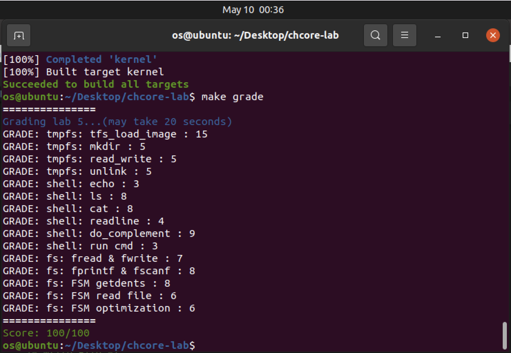

# OS-lab5: 多核、多进程、调度与IPC

**id: 519021910861** 
**name: xuhuidong**

## 目录

- [目录](#目录)
- [临时文件系统](#临时文件系统)
- [SHELL](#SHELL)
- [文件系统拓展](#文件系统拓展)


## 临时文件系统

> 练习题 1：实现位于 `userland/servers/tmpfs/tmpfs.c` 的 `tfs_mknod` 和 `tfs_namex`。

在 `tfs_mknod` 中，首先要判断是否存在同名文件。

```C++
if (tfs_lookup(dir, name, len) != NULL)
	return -EEXIST;
```

然后根据文件类型创建 `inode`。

```C++
struct inode* inode = mkdir ? new_dir() : new_reg();
```

并且创建新的 `dentry` 并加入到当前目录中。

```C++
struct dentry* dent = new_dent(inode, name, len);
init_hlist_node(&dent->node);
htable_add(*(dir->dentries), dent->name.hash, *dent->node);
```

在 `tfs_namex` 中，我们需要遍历文件系统结构来定位某个路径下的文件，具体实现详见 GitLab。

> 练习题 2：实现位于 `userland/servers/tmpfs/tmpfs.c` 的 `tfs_file_read` 和 `tfs_file_write` 。提示：由于数据块的大小为 PAGE_SIZE，因此读写可能会牵涉到多个页面，读取不能超过文件大小，而写入可能会增加文件大小（也可能需要创建新的数据块）。

在 `tfs_file_read` 中我们需要将每个数据块逐个读取并 `copy` 到 `buff` 中去，注意边界情况，核心代码如下。

```C++
to_read = MIN(inode->size - offset, size);
while (to_read > 0) {
	page_no = ROUND_DOWN(offset, PAGE_SIZE) / PAGE_SIZE;
	page = radix_get(&inode->data, page_no * PAGE_SIZE);
	u64 page_off = cur_off % PAGE_SIZE;
	 cur_to_read = MIN(PAGE_SIZE - page_off, to_read);
	/* copy data to buff */
	memcpy(buff, (char*) page + page_off, cur_to_read);
	/* update variables in one loop */
	to_read -= cur_to_read;
	cur_off += cur_to_read;
	buff += cur_to_read;
}
```

在 `tfs_file_write` 中，和 `tfs_file_read` 差不多，只是这次我们是要将用户输入的数据写入文件，并且还要注意，在文件不够大时需要分配新的数据块，详细代码见 GitLab。

> 练习题 3：实现位于 `userland/servers/tmpfs/tmpfs.c` 的 `tfs_load_image` 函数。需要通过之前实现的 tmpfs 函数进行目录和文件的创建，以及数据的读写。

我们需要调用之前的创建目录、创建文件以及读写文件的函数，详细代码见 GitLab。

> 练习题 4：利用 `userland/servers/tmpfs/tmpfs.c` 中已经实现的函数，完成在 `userland/servers/tmpfs/tmpfs_ops.c` 中的 `fs_creat` 、 `tmpfs_unlink` 和 `tmpfs_mkdir` 函数，从而使 `tmpfs_*` 函数可以被 `fs_server_dispatch` 调用以提供系统服务。

调用相应接口完成即可，详情代码见 GitLab。

## SHELL

> 练习题 5：实现在 `userland/servers/shell/main.c` 中定义的 `getch` ，该函数会每次从标准输入中获取字符，并实现在 `userland/servers/shell/shell.c` 中的 `readline`，该函数会将按下回车键之前的输入内容存入内存缓冲区。

在 `getch` 中，我们直接使用 `libchcore/include/libc/stdio.h` 中定义的 I/O 函数即可。

```C++
char getch()
{
	int c = getc();
	return (char) c;
}
```

在 `readline` 中，我们需要对用户在命令行输入的字符逐个解析，例如当遇到 `\r` 字符时我们需要调用系统函数 `__chcore_sys_putc('\n')` 来输出换行符。

而对 `\t` 的设计，主要在于需要进行补全根目录 `/` 下的文件名并输出，所以需要特殊处理：

```C++
while (true) {
	c = getch();
	if (c != '\t')
		complement_time = 0;
	...
	if (c == '\t') {
		char complement_buf[BUFLEN] = {0};
		char complement[BUFLEN] = {0};
		if (do_complement(complement_buf, complement, complement_time) == 0) {
      complement_time++;
      printf("%s", complement);
		}
    continue;
	}
  ...
}
```

> 练习题 6：根据在 `userland/servers/shell/shell.c` 中实现好的 `builtin_cmd` 函数，完成 shell 中内置命令对应 的 `do_*` 函数，需要支持的命令包括 `ls [dir]`、`echo [string]`、`cat [filename]` 和 `top`。

1. 我们一个个分别完成，首先看 `ls [dir]`，这条命令会在终端输出 `dir` 目录下所有的条目，即文件名称。

主要函数在 `fs_scan(char *path)` 中实现，由于给出的是 `path` 所以我们要自己先分配一个用户空间的 `fd`给他。

```C++
int fd = alloc_fd();
```

然后我们需要构造 IPC 请求。

```C++
ipc_msg_t* ipc_msg = ipc_create_msg(fs_ipc_struct_for_shell, sizeof(struct fs_request), 1);
struct fs_request* fr_ptr = ipc_get_msg_data(ipc_msg);
fr_ptr->req = FS_REQ_OPEN;
fr_ptr->open.new_fd = fd;
```

注意我们需要对路径名进行特殊处理，比如如果路径名为空则默认是根目录 `/`，还有如果路径名第一个字符不是 `/` 则需要添加进去。

```C++
if (strlen(path) == 0)
	strcpy((void *) fr_ptr->open.pathname, "/");
else if (*path != '/') {
	fr_ptr->open.pathname[0] = '/';
	strcpy((void *) (fr_ptr->open.pathname + 1), path);
} else {
	strcpy((void *) fr_ptr->open.pathname, path);
};
```

然后便可以发送 IPC 请求。

```C++
int ret = ipc_call(fs_ipc_struct_for_shell, ipc_msg);
ipc_destroy_msg(fs_ipc_struct_for_shell, ipc_msg);
```

最后我们可以参考 `demo_getdents` 函数来打印输出每条 `entry`。

2. 我们来看 `echo [string]`，这条命令更加直接，只要把 `string` 打印到终端上即可。

```C++
int do_echo(char *cmdline)
{
	cmdline += 4;
	while (*cmdline == ' ')
		cmdline++;
	printf("%s", cmdline);
};
```

3. 然后是 `cat [filename]`，需要我们打印文件内容，我们只需要分别发送 `OPEN`，`READ` 和 `CLOSE` 的 IPC 请求即可。

核心代码在发送接收 `READ` 请求。

```C++
memcpy(buf, ipc_get_msg_data(ipc_msg), ret);
printf("%s", buf);
```

> 练习题 7：实现在 `userland/servers/shell/shell.c` 中定义的 `run_cmd`，以通过输入文件名来运行可执行文件，同时补全 `do_complement` 函数并修改 `readline` 函数，以支持按 `tab` 键自动补全根目录 `/` 下的文件名。

我们首先对 `cmdline` 进行处理获得正确的 `pathbuf` ，然后调用 `chcore_procm_spawn` 来处理。详情代码见 GitLab。

## 文件系统拓展

> 练习题 8：补全 `userland/apps/lan5` 目录下的 `lab5_stdio.h` 与 `lab5_stdio.c` 文件，以实现 `fopen`，`fwrite`，`fread`，`fclose`，`fscanf`，`fprintf` 六个函数，函数用法应与 libc 中一致。

`fopen` 是打开文件，我们先发送 `OPEN` 的 IPC 请求尝试打开文件，返回值如果小于 0 则代表文件原先不存在，如果 `mode` 是 `w` 代表可写，就要先调用 `CREAT` 的 IPC 请求创建文件，然后再调用 `OPEN` 的 IPC 请求打开文件。

并且我们要构造用户的 `FILE*` 抽象，我的设计如下。

```C++
typedef struct FILE {
	int fd;
	unsigned int mode;
	char filename[FS_REQ_PATH_BUF_LEN];
	int offset;
	int refcnt;
} FILE;
```

`fwrite` 是写入文件，同理我们需要先调用 `LSEEK` 的 IPC 请求去设置写入的初始位置，然后再发送 `WRITE` 的 IPC 请求。**这里有点坑，因为其他的 IPC 请求所有的传递内容都在 `fs_request` 结构体中定义好了，唯独 `WRITE` 请求需要将写入的内容附在 `fs_request` 的后面**。

即我们需要以如下方式将写入内容放入 IPC 请求包中：

```C++
memcpy((void *) fr_ptr + sizeof(struct fs_request), src, nmemb);
```

因此在创建这个消息的时候我们也要分配大一些的空间。

```C++
ipc_msg = ipc_create_msg(tmpfs_ipc_struct, sizeof(struct fs_request) + nmemb + 1, 1);
```

**我能理解这么做是因为用户写入的内容大小未知，有可能很大，所以不能在 `fs_request` 中提前创建 `char wbuf[BUFLEN]` 来存，但我建议如果能在 `fs_request` 的 `write` 区域中加入 `char* wbuf` 会不会更好呢？ 这样就可以动态分配空间而且也易于理解，但我不确定 IPC 通信时的请求包会不会因为地址不连续而找不到写入的内容。以上仅是个人看法。**

`fread` 是读取文件内容，需要注意的是需要先发送 `LSEEK` 的 IPC 请求去设置读取的初始位置，然后再发送 `READ` 的 IPC 请求，并且将返回的文件内容 `copy` 到 `buff` 中，别忘了将 `FILE` 抽象中的 `offset` 增加相应的大小。

```C++
memcpy(destv, ipc_get_msg_data(ipc_msg), ret);
f->offset += ret;
```

`fclose` 是关闭文件，别忘了将 `FILE` 抽象中的 `refcnt` 减一。

```C++
if (--f->refcnt == 0)
	free(f);
```

`fscanf` 是格式化读取文件内容，比如我先定义格式 `"%s %d"` 则代表我要从文件中读取一个字符串和一个整数。这个地方的实现可以参考我们上学期编译原理的 `va_arg` 的实验，原理就是对格式进行解析，遇到 `%s` 就去文件里读个字符串出来，遇到了 `%d` 就去文件里读个整数出来。

`fprintf` 是格式化写入文件内容，这个和 `fscanf` 大同小异，只需要先把格式化的字符串中的 `%s` 和 `%d` 替换成对应的参数的值，然后再调用 `fwrite` 函数将该字符串写入文件中去。

> 练习题 9：FSM 需要两种不同的文件系统才能体现其特点，本实验提供了一个 fakefs 用于模拟部分文件系统的接口，测试代码会默认将 tmpfs 挂载到路径 `/`，并将 fakefs 挂载在到路径 `/fakefs`。本练习需要实现 `userland/server/fsm/main.c` 中空缺的部分，使得用户程序将文件系统请求发送给 FSM 后，FSM 根据访问路径

我们需要在 `fsm_server_disptach` 中补全这个转发 IPC 请求的逻辑，注意这是两个 IPC 不能复用，因此我们需要重新构造 IPC 请求发送给对应的文件系统，详情代码见 GitLab。

> 练习题 10：为减少文件操作过程中 IPC 次数，可以对 FSM 的转发机制进行简化。本练习需要完成 `libchcore/src/fs/fsm.c` 中空缺的部分，使得 `fsm_read_file` 和 `fsm_write_file` 函数先利用 `ID` 为 `FS_REQ_GET_FS_CAP` 的请求通过 FSM 处理文件路径并获取对应文件系统的 Capability，然后直接对相应文件系统发送文件操作请求。

这里的关键在于我们要先调用 `FS_REQ_GET_FS_CAP` 的 IPC 请求获取对应文件系统的 Capability ，然后再向对应的文件系统依次发送 `OPEN`，`WRITE/READ` 和 `CLOSE` 请求即可。详情代码见 GitLab。

最终，我完成了这个 Lab 并获得了满分。




