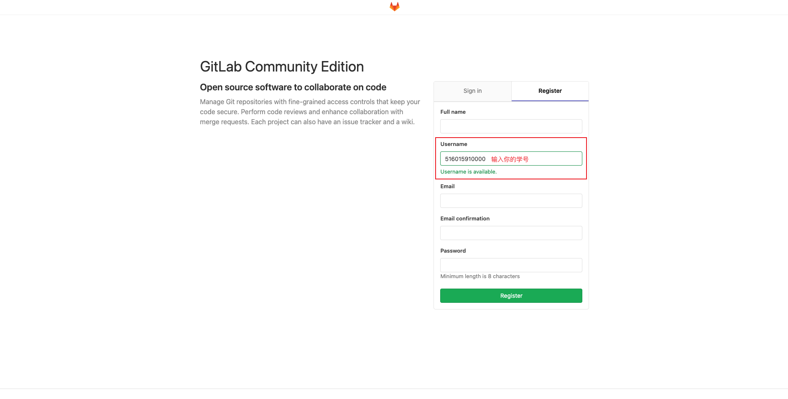
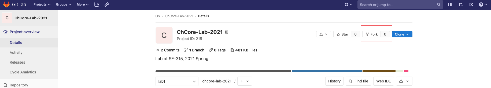
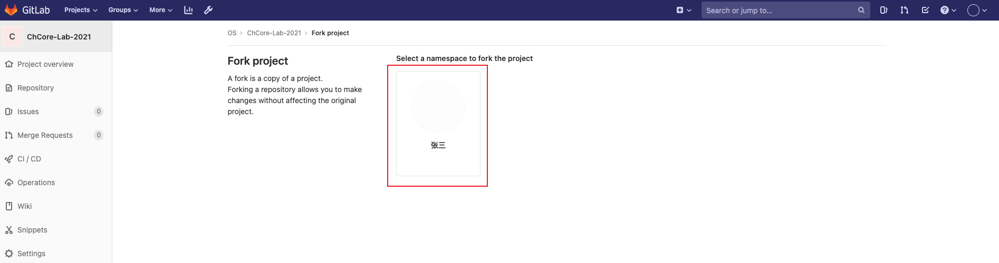
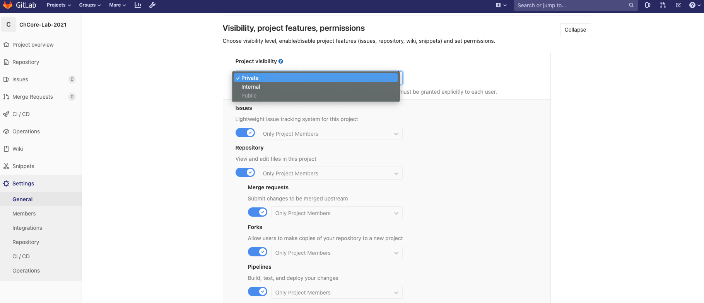
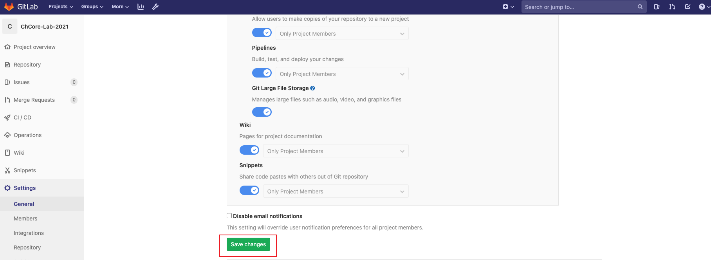
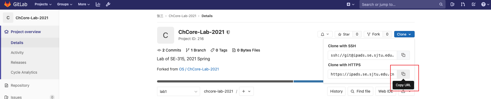

# 实验 0：环境搭建

在开始做 ChCore 实验之前，需要准备好一个适当的开发、构建和运行环境，并了解如何获取、更新和提交 ChCore 实验代码。

## 准备开发、构建和运行环境

在开始 ChCore 实验之前，需要准备一个适合自己的开发、构建和运行环境，根据同学自身（和自己的电脑）情况不同，下面提供几种方案以供选择。

### 方案一：使用助教提供的虚拟机（推荐）

我们为大家提供了两种不同平台的虚拟机，来供大家构建和运行 ChCore 实验：

- VirtualBox 虚拟机
    - [交大云盘](https://jbox.sjtu.edu.cn/l/K1XVOu)，提取密码：`os2022`，大小：6.94GB，MD5：c25f9064863e5e6d2be4aa30d41f92a8）
    - 你需要先安装 VirtualBox，然后导入我们已经配置好的虚拟机
- VMware 虚拟机
    - [交大云盘](https://jbox.sjtu.edu.cn/l/N15u1n)，提取密码：`os2022`，大小：4.55GB，MD5：6c6f30518a6562080e92bbf0db05d8f5
    - 你需要先安装 VMware Player、VMware Workstation 或 VMware Fusion，然后再导入虚拟机

在两个虚拟机中，用户名均为 `os`，密码均为 `123`。

如果导入虚拟机失败，通常是因为下载没完整，请检查你下载文件的大小以及 MD5，如果不匹配，请尝试重新下载虚拟机文件。

### 方案二：自己配置环境并使用 Docker

如果不想使用助教提供的虚拟机，可以在自己的 Linux 环境中安装所需的软件包，这里以 Ubuntu 为例：

- 按照 [Install Docker Engine on Ubuntu](https://docs.docker.com/engine/install/ubuntu/) 的指示安装 Docker
- 安装 `binutils-aarch64-linux-gnu` 以便在 Docker 外使用 `aarch64-linux-gnu-objdump` 等工具
- 安装 `qemu-system-arm`，用于模拟 ARM 平台，运行 ChCore

### 方案三：自己配置所有环境

> 提示：使用 Apple Silicon 或其他 ARM CPU 的同学，采用这种方法可能获得更快的构建速度。

请自行参考 ChCore 根目录的 `scripts/build/Dockerfile` 安装所需构建工具链（部分工具在实验中用不着，可自行判断），并留意后面构建和运行时使用的命令的不同。

## 获取 ChCore 代码

ChChore 实验代码的发布和提交均使用课程提供的 [GitLab 平台](https://ipads.se.sjtu.edu.cn:2020)。

### 创建 GitLab 账号

首先，打开 <https://ipads.se.sjtu.edu.cn:2020/users/sign_in> 进行注册，“Username”一栏请输入自己的学号，助教会根据用户名的学号来进行改分。



### Fork 实验仓库

登录你的 Gitlab 后，打开 <https://ipads.se.sjtu.edu.cn:2020/os-2022/chcore-lab> 来 fork 一份 ChCore 仓库代码副本到你自己的账户下。之后，你可以对你账户下的 ChCore 仓库代码进行任意修改和提交，而不会对原 ChCore 仓库产生影响。



点击你的 namespace，来完成 fork。



### 设置仓库的可见性

将刚才 fork 成功的仓库设置为 private（私有），防止其他同学浏览你的仓库、抄袭你的代码。ChCore 的实验是一个单人作业，每个同学都有防止抄袭和被抄袭的义务和责任，助教也有相关的代码查重工具，抄袭行为将会被判 0 分。



最后，别忘记保存你的设置！



### 将你的 ChChore 实验仓库下载到本地

首先复制你的仓库链接，进入你账户下的仓库网页，点击 clone 按钮，复制第二个链接（如果已经设置 SSH key，更建议使用 SSH 方式 clone）。



在之前下载的虚拟机（或自行配置的环境）中，打开命令行，运行（注意修改 `[username]` 并根据提示输入用户名和密码）：

```sh
$ git clone https://ipads.se.sjtu.edu.cn:2020/[username]/chcore-lab.git
Cloning into 'chcore-lab'...
Username for 'https://ipads.se.sjtu.edu.cn:2020': [username]
Password for 'https://username@ipads.se.sjtu.edu.cn:2020': [password]
remote: Enumerating objects: 3, done.
remote: Counting objects: 100% (3/3), done.
remote: Total 3 (delta 0), reused 0 (delta 0), pack-reused 0
Unpacking objects: 100% (3/3), done.
```

### 从原仓库中获取最新的实验代码

首先，你需要清楚三个概念：

- 原仓库（upstream）：助教发布实验代码的仓库，也是被 fork 出来的仓库
- 你在 GitLab 上的私人仓库（origin）：fork 出来的仓库，属于你私人账号的仓库，之后在本地仓库中的修改（commit）要推送（push）到这个仓库
- 本地仓库（local）：存在于你本地环境的仓库

助教之后会陆续放出每个 lab 的代码，因此，在每次开始实验之前，你需要从原仓库中获取最新的 lab 代码。这个步骤是建立本地仓库与原仓库之间的联系，使得你的本地仓库可以从原仓库中获取更新。

```sh
$ cd chcore-lab
$ git remote add upstream https://ipads.se.sjtu.edu.cn:2020/os-2022/chcore-lab.git
$ git fetch upstream
From https://ipads.se.sjtu.edu.cn:2020/os-2022/chcore-lab
 * [new branch]      lab1     -> upstream/lab1
```

之后，当你需要获取更新时，只需要执行 `git fetch upstream` 命令即可。`git fetch` 只会将原仓库中的更新下载到与你当前的工作分支不同的其它分支（例如 `upstream/lab1`），并不会对你当前分支的代码进行修改。

通过 `git remote -v` 命令可以看到，你的本地仓库一共有两个远端仓库 `origin` 和 `upstream`。`origin` 是你在 GitLab 的私人仓库对应的地址，之后你在本地的提交（commit）需要提交到 `orgin`。`upstream` 是助教管理的仓库的地址，你需要从 `upstream` 获取下一个实验的代码。

```sh
$ git remote -v
origin  https://ipads.se.sjtu.edu.cn:2020/[username]/chcore-lab.git (fetch)
origin  https://ipads.se.sjtu.edu.cn:2020/[username]/chcore-lab.git (push)
upstream  https://ipads.se.sjtu.edu.cn:2020/os-2022/chcore-lab.git (fetch)
upstream  https://ipads.se.sjtu.edu.cn:2020/os-2022/chcore-lab.git (push)
```

### 获取下一个实验的代码，并切换到下一个实验的代码分支

由于 `lab1` 分支在 fork 和 clone 到本地的时候已经存在，因此不需要进行如下的操作，之后的 `lab2`、`lab3`、`lab4`、`lab5` 均需要通过以下方式获取助教发布的代码，并切换到新的代码分支。

在 ChCore 中，每一个实验都会有一个单独的代码分支（branch），例如 `lab1`、`lab2` 以及 `labx`（`x` 指代某个数字）。当助教在原仓库中放出 `labx` 的代码时，你需要：

- 执行 `git fetch upstream` 来获取最新的更新和分支信息
- 执行 `git checkout -b labx upstream/labx` 来创建一个新的分支 `labx`，`-b labx`的意思是创建一个新的名为 `labx` 的分支，而 `upstream/labx` 则指定了本地的分支是基于原仓库的 `labx` 分支创建的
- `git push -u origin` 将本地仓库中的 `labx` 和你 GitLab 上私人仓库的 `labx` 分支进行绑定，并将本地仓库的 `labx` 分支推送到远端私人仓库的 `labx` 分支
- 执行 `git merge labx-1`，将你之前的实验代码合并到当前分支上，这里的 `x-1` 指代上一个 lab 的数字

下面的操作说明，如何切换到下一个实验代码分支来进行实验。假设你已经做完了第 x-1 个实验，下面要切换到第 x 个实验：

```sh
$ git fetch upstream
$ git checkout -b labx upstream/labx
Branch 'labx' set up to track remote branch 'labx' from 'upstream'.
Switched to a new branch 'labx'
$ git push -u origin
To https://ipads.se.sjtu.edu.cn:2020/[username]/chcore-lab-2021.git
 * [new branch]      labx -> labx
Branch 'labx' set up to track remote branch 'labx' from 'origin'.
$ git merge lab(x-1)
```

`git merge` 命令有时候并不能自动地进行合并，别忘了手动处理这些冲突！

## 构建和运行 ChCore

在 ChCore 实验代码的根目录（以后称 ChCore 根目录）运行下面命令可以构建和使用 QEMU 运行 ChCore：

```sh
$ make # 或 make build
$ make qemu # 在尚未完成 lab 1 时，可能没有任何输出
```

如果你在准备环境阶段采用了第三种方案，则需要使用形如下面的命令：

```sh
$ make CHBUILD="./chbuild -l" # 更换 chbuild 命令，通过 -l 参数指定使用宿主机而非 Docker 环境
```

## 获取参考评分

在 ChCore 根目录运行下面命令可检查当前得分：

```sh
$ make grade
...
===============
Score: 100/100
```

注意，此得分仅供参考，部分实验步骤无法通过评分脚本获得正确性检查，但可能会影响后续实验的进行。助教在最终评分时，会综合评分脚本结果、实际编写的代码和实验报告进行评价。
