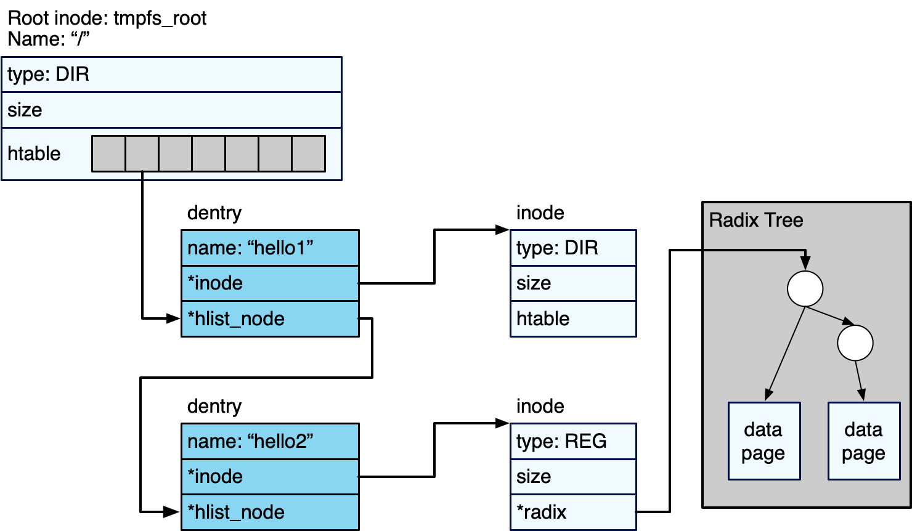
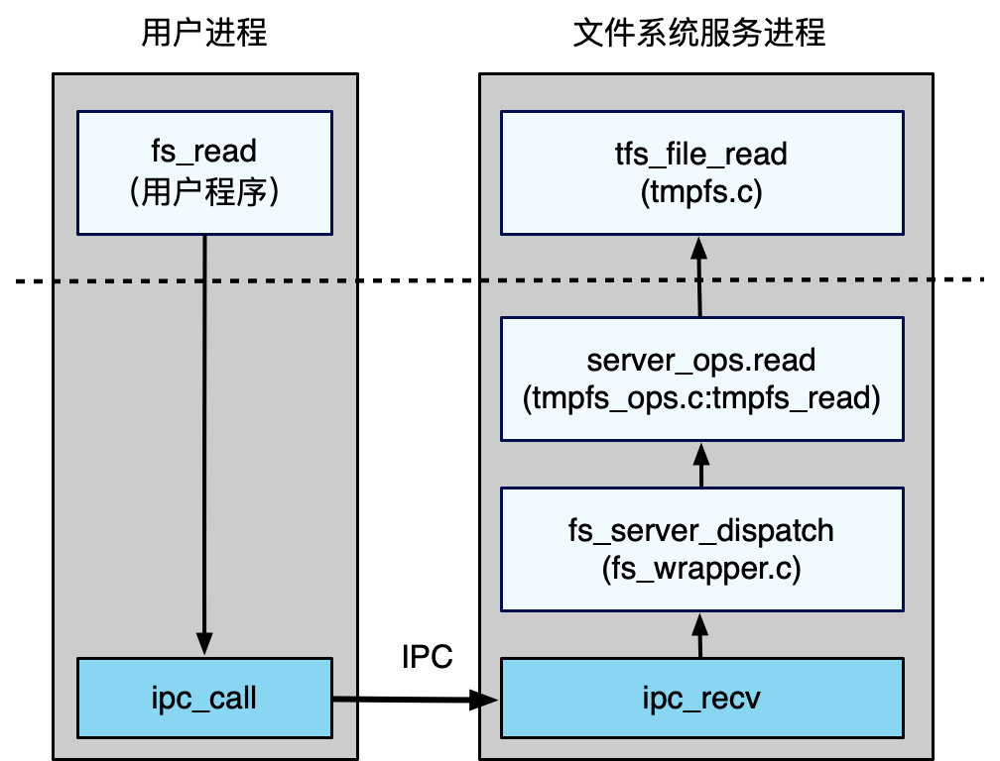
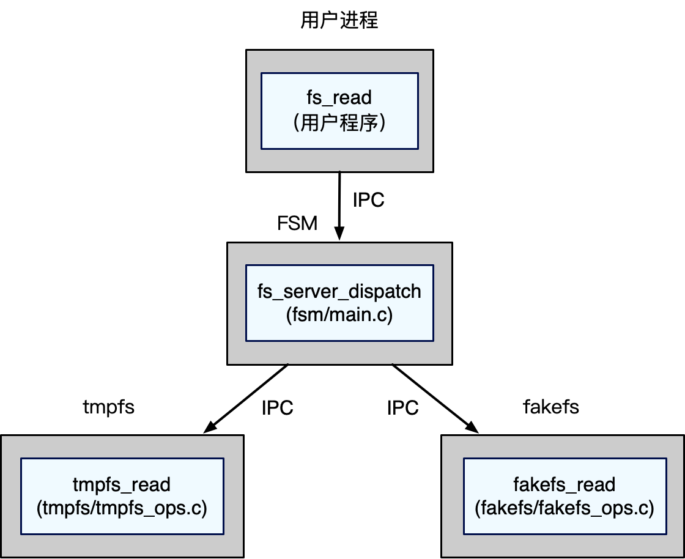

# 实验 5：文件系统与SHELL

## 简介

在微内核架构下，文件系统作为系统服务运行在用户态。本实验的第一部分将实现一种基于索引节点（index node，inode）的用户态内存文件系统：临时文件系统（temporary file system，tmpfs）。第二部分将实现一个shell程序，提供用户和操作系统交互的方式，包括文件和目录相关的简单命令。第三部分将实现一种简单的微内核架构下的虚拟文件系统（Virtual File Systems, VFS），能够管理不同文件系统并为应用提供统一的文件操作接口。

## 第一部分：临时文件系统

### tmpfs简介

tmpfs是基于inode的内存文件系统，即使用内存空间作为文件系统的存储空间，并且将存储空间分为inode区域和数据区域。在inode区域中，存储着每个文件的inode，该inode中保存有关该文件的元数据，例如文件大小，以及该文件数据块的位置。数据区域存储文件数据块，tmpfs中的文件数据块由一系列分散的内存页组成。文件分为常规文件和目录文件：常规文件存储数据本身，目录文件存储从文件名到目录项（dicrectory entry，dentry）的哈希表映射。

ChCore的tmpfs位于`userland/servers/tmpfs`，如图所示，具有以下几个重要的数据结构（结构的定义位于`libchcore/include/chcore/fs/defs.h`中）：

- inode。每个inode对应一个文件，记录文件类型（type：常规REG/目录DIR）和文件大小（size）。接口`new_dir`和`new_reg`用于创建这两种类型的inode。
- 目录。目录inode存储一个指向哈希表htable的指针，该哈希表从文件名的哈希值映射到dentry。哈希表中的每个哈希桶都存储dentry的链表，并且通过hlist_node指针链接。其中，`tmpfs_root`表示根目录（`/`）的 inode。
- 每个常规文件的数据块以基数树的形式组织，树的根节点指针保存在常规文件inode中。该树的叶节点是大小为PAGE_SIZE的数据块（即内存页），通过内存页的顺序编号搜索。



### 实验内容
tmpfs的基本功能在`userland/servers/tmpfs/tmpfs.c` 与 `userland/servers/tmpfs/tmpfs_ops.c`中定义，实现过程中请参考头文件`userland/servers/tmpfs/tmpfs.h`和`userland/servers/tmpfs/tmpfs_ops.h`，以及已实现函数的相关代码和注释。在实现基本的文件操作之前，需要先实现一些修改文件结构的辅助函数：`tfs_mknod`和`tfs_namex`。`tfs_mknod`函数用于创建文件时，在父目录下创建目录inode或常规文件inode。`tfs_namex`函数用于遍历文件系统以查找文件。

> 练习题 1：实现位于`userland/servers/tmpfs/tmpfs.c`的`tfs_mknod`和`tfs_namex`。

文件读写是文件系统的基本功能，tmpfs的读写操作会将文件数据块中内容读入内存缓冲区，或将缓冲区内容写入对应文件数据块。`tfs_file_read`和 `tfs_file_write`两个函数分别用于以一定偏移量读取和写入一段长度的数据，并且返回实际的读写字节长度
（读取不能超过文件大小）。

> 练习题 2：实现位于`userland/servers/tmpfs/tmpfs.c`的`tfs_file_read`和`tfs_file_write`。提示：由于数据块的大小为PAGE_SIZE，因此读写可能会牵涉到多个页面。读取不能超过文件大小，而写入可能会增加文件大小（也可能需要创建新的数据块）。

在实验5中，用户态程序会被编译为ELF文件（`userland/_build/ramdisk/*.bin`），并与测试文件`userland/_build/ramdisk/test.txt`一起，连接为一个后缀名为`cpio`的文件。cpio的每个成员文件都包含一个头（在`userland/servers/tmpfs/cpio.h`中定义），后面是文件内容。cpio的末尾是一个名为`TRAILER!!!`的空文件表示终止。本实验中，tmpfs会通过`tfs_load_image`加载`ramdisk.cpio`中的内容。

> 练习题 3：实现位于`userland/servers/tmpfs/tmpfs.c`的`tfs_load_image`函数。需要通过之前实现的tmpfs函数进行目录和文件的创建，以及数据的读写。

正确完以上所有练习后，输入`make grade LAB=5`总共可以获得15分。

用户程序需要通过IPC给文件系统服务发送请求以使用文件系统。以文件读取为例，在下图中的虚线上方是用户程序和文件系统的主要处理逻辑，虚线下方是文件系统服务的IPC处理机制。用户程序通过调用由用户实现的`fs_read`，使用`ipc_call`将消息发送到文件系统服务进程。

文件系统服务主函数在`userland/servers/tmpfs/main.c`中定义。其主要逻辑是轮询IPC请求，通过`fs_server_dispatch`将请求分派到适当的处理函数，完成处理后，再通过IPC将结果返回。tmpfs的处理函数在`userland/servers/tmpfs_ops.{h,c}`中定义。

`fs_server_dispatch`函数在`userland/fs_base/fs_wrapper.c`中实现，在本实验中，不同文件系统可共用的逻辑（如根据IPC请求分派处理函数等）被包装在`userland/servers/fs_base`中，不同的文件系统可以共用这部分已经实现的逻辑，本实验过程中不会修改该目录下的内容。`fs_server_dispatch`会在解析IPC请求后，根据请求类型的不同，利用注册在结构体`server_ops`中的函数指针，调用不同的文件系统函数。
在下图示例中，`fs_server_dispatch`将请求分派到`server_ops.read`，在tmpfs中，该函数指针已经指向`tmpfs_read`，并最终调用`tfs_file_read`来实际进行文件读取。



> 练习题 4：利用`userland/servers/tmpfs/tmpfs.c`中已经实现的函数，完成在`userland/servers/tmpfs/tmpfs_ops.c`中的`fs_creat`、`tmpfs_unlink`和`tmpfs_mkdir`函数，从而使`tmpfs_*`函数可以被`fs_server_dispatch`调用以提供系统服务。对应关系可以参照`userland/servers/tmpfs/tmpfs_ops.c`中`server_ops`的设置以及`userland/fs_base/fs_wrapper.c`的`fs_server_dispatch`函数。在本实验中只需考虑如下几个文件操作函数：

| 请求ID | 函数 | 功能 |
| :---- | :---- | :---- |
| FS_REQ_OPEN | tmpfs_open | 打开文件 |
| FS_REQ_READ | tmpfs_read | 读文件 |
| FS_REQ_WRITE | tmpfs_write | 写文件 |
| FS_REQ_CLOSE | tmpfs_close | 关闭文件 |
| FS_REQ_CREAT | tmpfs_creat | 创建文件 |
| FS_REQ_UNLINK | tmpfs_unlink | 移除文件 |
| FS_REQ_RMDIR | tmpfs_mkdir | 创建目录 |
| FS_REQ_MKDIR | tmpfs_rmdir | 移除目录 |
| FS_REQ_GETDENTS64 | tmpfs_getdents | 获取目录文件信息 |
| FS_REQ_GET_SIZE | tmpfs_get_size | 获取文件大小 |

> 提示：`userland/server/fs_base/fs_wrapper.c`中会维护用户态进程的文件描述符`fd`到文件系统`fid`的映射，用户态程序在进行文件操作时需自行分配`fd`，而一个文件的`fid`在该文件系统中是唯一的，与文件一一对应，该`fd`到`fid`的映射会在调用`FS_REQ_OPEN`时被`fs_server_dispatch`创建。
> 所有`userland/servers/tmpfs`目录下出现的`fd`，均已经在`fs_server_dispatch`中被转化为`fid`。
>
> **注意：本部分测试需要打开`CHCORE_TMPFS_TEST`，即在`.config`文件中如下行选择`ON`。**
> ```
> CHCORE_TMPFS_TEST:BOOL=ON
> ```

正确完成以上所有练习后，输入`make grade LAB=5`可以获得30分。

## 第二部分：SHELL
本实验的第二部分是实现用户态shell，该用户态shell在`userland/servers/shell`中实现。

> 练习题 5：实现在`userland/servers/shell/main.c`中定义的`getch`，该函数会每次从标准输入中获取字符，并实现在`userland/servers/shell/shell.c`中的`readline`，该函数会将按下回车键之前的输入内容存入内存缓冲区。代码中可以使用在`libchcore/include/libc/stdio.h`中的定义的I/O函数。

> 练习题 6：根据在`userland/servers/shell/shell.c`中实现好的`bultin_cmd`函数，完成shell中内置命令对应的`do_*`函数，需要支持的命令包括：`ls [dir]`、`echo [string]`、`cat [filename]`和`top`。

> 练习题 7：实现在`userland/servers/shell/shell.c`中定义的`run_cmd`，以通过输入文件名来运行可执行文件，同时补全`do_complement`函数并修改`readline`函数，以支持按tab键自动补全根目录（`/`）下的文件名。
>
> **注意：本部分测试需要打开`CHCORE_SHELL_TEST`，即在`.config`文件中如下行选择`ON`。**
> ```
> CHCORE_SHELL_TEST:BOOL=ON
> ```

正确完以上所有后，输入`make grade LAB=5`总共可以获得65分。

## 第三部分：文件系统拓展

### 文件系统用户态接口

目前，应用程序只能通过IPC直接将请求发送给文件系统进程，为了更方便地对文件系统进行访问，通常需要对文件系统接口进行一定的封装。

> 练习题 8：补全`userland/apps/lab5`目录下的`lab5_stdio.h`与`lab5_stdio.c`文件，以实现`fopen`, `fwrite`, `fread`, `fclose`, `fscanf`, `fprintf`五个函数，函数用法应与libc中一致，可以参照`lab5_main.c`中测试代码。
>
> **注意：本部分测试需要打开`CHCORE_SHELL_TEST`，即在`.config`文件中如下行选择`ON`。**
> ```
> CHCORE_SHELL_TEST:BOOL=ON
> ```


正确完成以上所有练习后，输入`make grade LAB=5`可以获得80分。

### 虚拟文件系统

虚拟文件系统（VFS）是一层抽象，使得应用程序能够以统一的接口访问不同类型的文件系统。本实验中将再实现一个系统服务FSM（File System Manager）协助实现虚拟文件系统抽象。如下图所示，当存在多个文件系统时，用户态应用只需要将IPC请求发送给FSM，FSM会分析被请求路径所在的文件系统，并将请求发送给对应的文件系统进程，因此应用程序仅通过FSM就可以访问不同的文件系统。

> 练习题 9：FSM需要两种不同的文件系统才能体现其特点，本实验提供了一个fakefs用于模拟部分文件系统的接口，测试代码会默认将tmpfs挂载到路径`/`，并将fakefs挂载在到路径`/fakefs`。本练习需要实现`userland/server/fsm/main.c`中空缺的部分，使得用户程序将文件系统请求发送给FSM后，FSM根据访问路径向对应文件系统发起请求，并将结果返回给用户程序。实现过程中可以使用`userland/server/fsm`目录下已经实现的函数。

> 提示：本练习中只需考虑已经在tmpsfs中实现的请求类型。本练习的测试代码会用到shell中已经实现的`ls`与`cat`命令。



> 练习题 10：为减少文件操作过程中的IPC次数，可以对FSM的转发机制进行简化。本练习需要完成`libchcore/src/fs/fsm.c`中空缺的部分，使得`fsm_read_file`和`fsm_write_file`函数先利用ID为FS_REQ_GET_FS_CAP的请求通过FSM处理文件路径并获取对应文件系统的 Capability，然后直接对相应文件系统发送文件操作请求。
>
> **注意：本部分测试需要打开`CHCORE_FSM_TEST`，即在`.config`文件中如下行选择`ON`。**
> ```
> CHCORE_FSM_TEST:BOOL=ON
> ```

正确完成以上所有练习后，输入`make grade LAB=5`可以获得100分。
